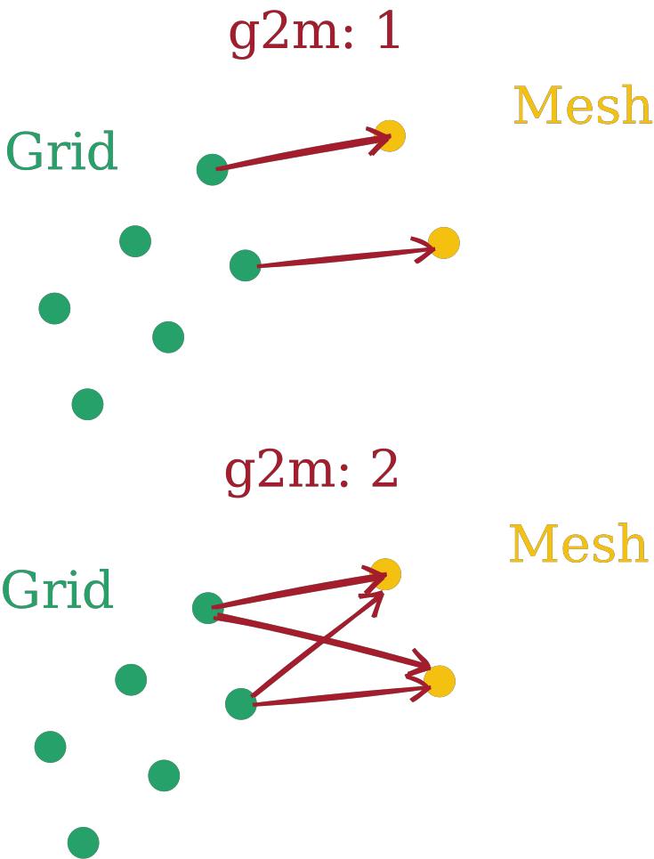
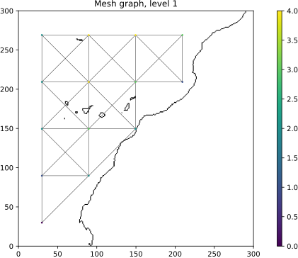
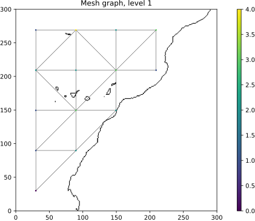
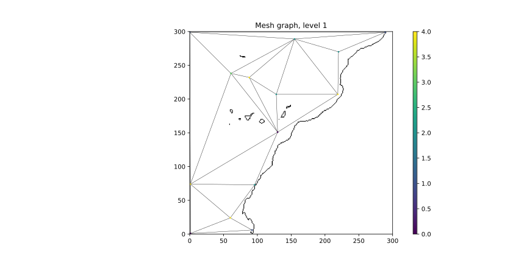
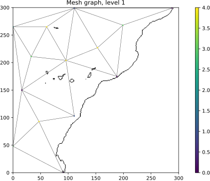
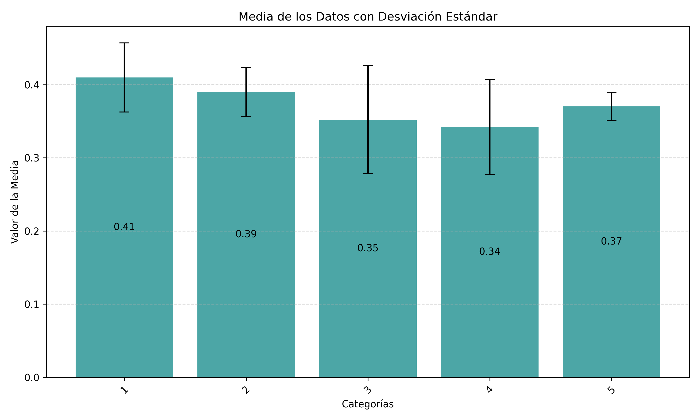
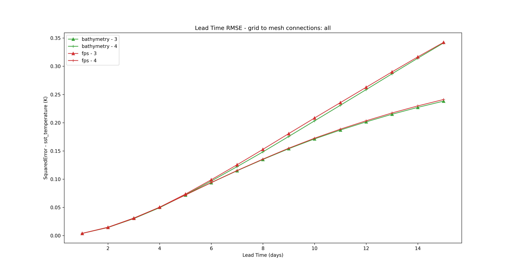

# Description of results

**Experimental setup (summary).**
We ran 20 experiments to evaluate how the number of connections (edges) between a 300×300 grid and different mesh topologies affects GraphCast performance on an oceanographic prediction task. For the encoder, the “connections” parameter means: if set to 1, each grid node connects to the single nearest mesh node; if set to 2, each grid node connects to the two nearest mesh nodes, and so on. The decoder uses the same (but inverted) pattern. 

Two families of mesh were tested:

* **Uniform quad meshes**

  * *crossing\_edges*: grid-like quad elements where diagonals across an element are allowed (both crossing diagonals present).
  

  * *non\_crossing\_edges*: the same grid-like structure but with only one diagonal per quad element (no crossing).

* **Non-uniform triangular meshes (Delaunay-based)**

  * *bathymetry*: triangular elements refined according to bathymetry (finer elements where depth changes).
  * *fps*: triangular elements refined with Farthest Point Sampling (finer near the coast).

For each mesh type we trained models using **1, 2, 3, 4, and 5 connections** between grid and mesh (5 configurations × 4 meshes = 20 experiments). Performance metrics computed include **RMSE, MAE and Bias**; the report focuses on RMSE for model-selection and comparison.

**RMSE table (per mesh × connections).**

| Mesh type                | Connections = 1 | Connections = 2 | Connections = 3 | Connections = 4 | Connections = 5 |  Best RMSE |
| :----------------------- | :-------------: | :-------------: | :-------------: | :-------------: | :-------------: | :--------: |
| **crossing\_edges**      |      0.3565     |      0.4199     |      0.3889     |      0.4181     |      0.4008     |   0.3565   |
| **non\_crossing\_edges** |      0.4171     |      0.3378     |      0.4383     |      0.3678     |      0.3672     |   0.3378   |
| **bathymetry**           |      0.4827     |      0.3819     |    **0.2382**   |      0.3413     |      0.3613     | **0.2382** |
| **fps**                  |      0.3829     |      0.4203     |      0.3424     |      0.2411     |      0.3510     |   0.2411   |

**Aggregate RMSE statistics (mean ± std over the 5 connection counts).**

| Mesh type                | Mean RMSE | Std. dev. |
| :----------------------- | :-------: | :-------: |
| **fps**                  |   0.3475  |   0.0599  |
| **bathymetry**           |   0.3611  |   0.0784  |
| **non\_crossing\_edges** |   0.3856  |   0.0366  |
| **crossing\_edges**      |   0.3968  |   0.0232  |

**Key numerical findings.**

* The **lowest absolute RMSE** is achieved by **bathymetry with 3 connections** (RMSE = **0.2382**).
* A close second in absolute performance is **fps with 4 connections** (RMSE = **0.2411**).
* On average, **fps** has the best mean RMSE across connection settings (0.3475) and a moderate standard deviation (0.0599), indicating consistent performance.
* **Bathymetry** shows the largest variability (std = 0.0784): it can produce the best absolute result but is more sensitive to the number of connections.

**What the plot shows (summary).**
The bar chart displays the **mean RMSE** (bar height) and **standard deviation** (error bars) computed **across all four mesh types** for each number of grid→mesh connections (1 through 5). The numeric means and standard deviations for each connection count are:

* **Connections = 1:** mean RMSE = **0.4098**, std = **0.0473**
* **Connections = 2:** mean RMSE = **0.3900**, std = **0.0339**
* **Connections = 3:** mean RMSE = **0.3520**, std = **0.0739**
* **Connections = 4:** mean RMSE = **0.3421**, std = **0.0645**
* **Connections = 5:** mean RMSE = **0.3701**, std = **0.0187**

These statistics summarize performance averaged over the four mesh topologies (crossing\_edges, non\_crossing\_edges, bathymetry, fps) for each connection count.

---
This report analyzes the performance of a GraphCast model across different configurations by examining the Root Mean Squared Error (RMSE) over a 15-day forecast horizon.

# Analysis of results

**Effect of number of connections.**
The number of edges between grid and mesh acts as a critical hyperparameter: it mediates how much spatial information flows between the dense grid representation and the sparser mesh. Results show there is **no monotonic “more connections = better”** behavior. Instead, each mesh topology has a different optimal connection count (e.g., bathymetry → 3; fps → 4; non\_crossing → 2; crossing → 1). This indicates a clear interaction between mesh geometry and effective receptive field matching between grid and mesh nodes.

**Mesh-specific observations.**

* **Bathymetry mesh:** Highest potential for accuracy when paired with the right connection count (3). The bathymetry-driven refinement concentrates mesh resolution where bathymetric gradients are large (coastlines, depth changes), which appears to help the model capture important oceanographic structures—but only if connections are tuned correctly. The high standard deviation across connection counts suggests bathymetry’s performance is sensitive to under- or over-connecting grid-to-mesh nodes.
* **FPS mesh:** Provides consistently good performance across connection choices (best mean RMSE). Its coastal refinement strategy yields robust, stable results; it is less sensitive to small changes in the number of connections, making it a strong candidate when robustness is preferred over squeezing out the single best RMSE.
* **Uniform meshes (crossing vs non-crossing):** Both uniform quad meshes achieve moderate performance overall. Non-crossing achieved its best result at 2 connections (RMSE 0.3378), better than crossing’s best (0.3565 at 1 connection). Crossing has the smallest variability (std 0.0232) but also the highest average RMSE, suggesting its structural simplicity yields stable but limited representational power compared to adaptive triangular meshes.

**Stability vs. peak performance trade-off.**

* **Peak-performance strategy:** If the objective is to minimize RMSE at all costs, selecting the bathymetry mesh with its optimal connection count yields the best number (0.2382). However, because its performance can vary widely with connection choice, this strategy requires careful tuning and validation to ensure the chosen configuration generalizes.
* **Robustness strategy:** If consistent, less configuration-sensitive performance is preferred, fps with 4 connections is recommended. It delivers near-best absolute performance while showing smaller sensitivity to hyperparameter selection.

**Additional considerations not captured by RMSE alone.**

* **MAE and Bias** were recorded (as stated), but detailed values are not listed here; these would be useful to confirm whether RMSE improvements stem from reduced large errors or systematic bias reduction.
* **Computational cost:** More connections increase the number of graph edges and thus memory and runtime. The optimal trade-off between performance and computational cost was not quantified here and should be considered before deployment.

**Average performance trend.**
Mean RMSE decreases as the number of connections increases from 1 to 4, reaching a minimum at **4 connections (0.3421)**, and then increases again at 5 connections. In other words, **on average across meshes, 3–4 connections produce substantially better RMSE than 1–2 or 5**.

**Variability and sensitivity.**
The standard deviations reveal how sensitive performance is to mesh topology at each connection count:

* **Highest variability** occurs at **3 connections (std ≈ 0.0739)** and **4 connections (std ≈ 0.0645)**. This means the benefit of 3–4 connections depends strongly on which mesh is used—some meshes gain a lot, others less so.
* **Lowest variability** occurs at **5 connections (std ≈ 0.0187)** and **2 connections (std ≈ 0.0339)**: these settings produce more consistent (but not always better) results across meshes.

**Interpretation in context of prior per-mesh results.**
Recall that the single best absolute RMSE in the earlier per-mesh table was **bathymetry with 3 connections (0.2382)**, while **fps with 4 connections (0.2411)** was a strong robust runner-up. The present aggregated plot shows that **when averaging over all meshes, 4 connections are the best on average**, even though the absolute minimum (for a single mesh) occurred at 3 connections. This highlights a classic trade-off:

* **Peak performance (single best config):** May be achieved by tuning mesh + connections (e.g., bathymetry\@3).
* **Average/robust performance:** Achieved by choosing a connection count (4) that works well across different meshes.

**Practical note on computational cost.**
Increasing connections raises the number of graph edges and therefore memory/time. Since 4 connections gives the best average RMSE while 5 increases cost but worsens mean error, **4 connections appear a sensible balance** between accuracy and added graph complexity—subject to per-mesh verification.

---
The graph shows the evolution of RMSE for four configurations: **bathymetry (3 connections)**, **bathymetry (4 connections)**, **fps (3 connections)**, and **fps (4 connections)**. The curves show a monotonic increase, meaning errors are low for short lead times and increase steadily toward day 15. Visually, the configurations form two distinct performance "bands": a lower RMSE group for the two bathymetry curves and a higher RMSE group for the two fps curves. The differences are small in the initial days but amplify as the forecast horizon lengthens.

To quantify the gap between the pairs, the RMSE values for each lead time were visually estimated. The day-by-day differences were then calculated for the following pairs:

* **Pair A:** fps (3) − bathymetry (3)
* **Pair B:** fps (4) − bathymetry (4)

***Note on Methodology:*** The following figures are estimates based on a visual digitization of the graph and not from the original dataset. For precise results, calculations should be performed on the original numerical series.

#### Statistical Summary of Estimated Differences

| Compared Pair | Mean Difference (RMSE) | Std. Dev. | Max Difference | Lead Time of Max |
| :--- | :---: | :---: | :---: | :---: |
| **fps(3) − bathy(3)** | ≈ 0.031 | ≈ 0.032 | 0.10 | Day 15 |
| **fps(4) − bathy(4)** | ≈ 0.032 | ≈ 0.033 | 0.10 | Day 15 |

The average difference over the 15 days is small, approximately **0.03 RMSE-units**. However, the maximum difference reaches around **0.10 by day 15**. In relative terms, if the RMSE on day 15 is approximately 0.34, a difference of 0.10 represents a relative increase of about 29%, which is a significant degradation in performance for long-range forecasts. The variability in the difference (standard deviation ≈ 0.03) confirms that the performance gap widens with lead time, starting as negligible in days 1-4, becoming moderate in days 5-9, and substantial in days 10-15.

# Conclusions

**Main conclusions.**

1. **Best absolute configuration:** *Bathymetry mesh with 3 connections* produced the lowest RMSE observed (0.2382). This indicates that bathymetry-aware mesh refinement, combined with a carefully chosen number of grid→mesh connections, can substantially improve accuracy for oceanographic prediction on a 300×300 grid.
2. **Best robust configuration:** *FPS mesh with 4 connections* offers a strong, more robust alternative—good mean performance and lower sensitivity to connection count.
3. **Connections are critical:** The number of grid–mesh connections is a key hyperparameter that interacts with mesh topology. There is no universal rule (“more is better”); each mesh type has a distinct optimum.
4. **Uniform quad meshes** are stable but achieve higher average error than adaptive triangular meshes (bathymetry, fps).

**Recommendations (next steps).**

* **Statistical validation:** Repeat experiments with multiple random seeds and different train/validation splits to test whether observed RMSE differences (e.g., bathymetry\@3 vs fps\@4) are statistically significant.
* **Wider hyperparameter sweep:** Explore a broader range of connection counts (e.g., 6–10) and possibly non-integer strategies (e.g., adaptive, distance-weighted connections) to see whether other optima exist.
* **Cost–benefit analysis:** Measure memory and runtime for each configuration to weigh performance gains against computational expense—particularly important for production deployment.
* **Report MAE/Bias details:** Publish full MAE and Bias tables to verify whether RMSE improvements correspond to reductions in systematic bias or to fewer large errors.
* **Robustness checks:** Evaluate generalization across different geographic regions, seasons, or held-out bathymetries to ensure the selected configuration generalizes beyond the training conditions.

1. **Best average setting:** Across mesh types, **4 connections** achieve the lowest mean RMSE (0.3421).
2. **Best single-case potential:** Certain mesh-specific combinations (bathymetry\@3) can outperform the average substantially—so mesh-aware tuning matters.
3. **Sensitivity:** The most promising connection counts (3 and 4) also show the largest variability across meshes, meaning they require mesh-specific validation.
---
**Recommendations / next steps.**

* **If you must pick one default:** Use **4 connections** for a robust, average-optimal starting point.
* **If you can tune by mesh:** Perform per-mesh hyperparameter searches—bathymetry favored fewer connections (3), while fps favored 4.
* **Statistical testing:** Run multiple random seeds and compute confidence intervals or significance tests to confirm that the mean differences (e.g., 3 vs 4 vs 5) are statistically meaningful.
* **Cost–benefit check:** Measure training/inference time and memory for 3, 4, and 5 connections to confirm 4 is acceptable computationally.
* **Deeper diagnostics:** Produce per-mesh boxplots or violin plots of RMSE (across seeds) for each connection count, and include MAE/Bias breakdowns, to understand whether improvements reduce large errors or correct bias.
---
### Key Conclusions

* The **`bathymetry` configurations (3 and 4 connections)** consistently outperform the **`fps` configurations (3 and 4 connections)** in these tests. The performance gap is minimal for short-range forecasts but becomes more pronounced and operationally relevant for long-range forecasts.
* The **maximum difference** of approximately **0.10 RMSE-units at day 15** is not negligible and could be critical depending on the application. 

#### Practical Recommendations

1.  **Statistical Validation:** Conduct rigorous statistical tests (e.g., paired t-test or Wilcoxon test) on the original numerical RMSE series from multiple experimental runs. This will confirm if the observed difference at long lead times is statistically significant and not just a result of random variation.
2.  **Operational Impact Assessment:** If the accuracy of long-range forecasts (e.g., up to day 15) is critical for your application, the performance difference justifies a preference for the **`bathymetry` configuration**.
3.  **Cost-Benefit Analysis:** Measure the computational cost (time and memory) of both configurations. If `bathymetry` is more resource-intensive, evaluate whether the gain in RMSE justifies the additional cost.
4.  **Use Original Data:** For definitive conclusions, perform the exact calculations on the numerical RMSE data. This will provide precise metrics and eliminate the uncertainty from visual estimation.