# Description of results
---

## Nodes configurations
We use the following approach to set the number of nodes for each configuration:

For the 1 level:
```Julia
φ = (1 + sqrt(5))/2 # Golden ratio
N = [25]
for i in 1:10
    push!(N, round(Int, φ * N[end]))
end
```

For the 2 level:
```Julia
m = [5, 6, 8, 10, 13, 17]  # closest square from L1
p = 0.52
n = [round(mi * sqrt(p)) for mi in m]
```

## Resultados del análisis por horizonte de predicción

When increasing the number of nodes across the four mesh configurations, the error curves remain nearly indistinguishable during the first four to five lead-time days. In this initial range, mesh topology does not appear to play a decisive role, suggesting that short-term forecast skill is primarily governed by recent observational states and the model’s baseline predictive capacity rather than by spatial connectivity patterns.


From day five onward, however, the RMSE curves clearly diverge. The structured meshes—both with and without crossing edges—exhibit a steeper increase in error as lead time advances. In contrast, the unstructured meshes (FPS and bathymetry-based) maintain notably lower error growth, indicating a more efficient handling of information flow once the forecast becomes less constrained by the initial state.

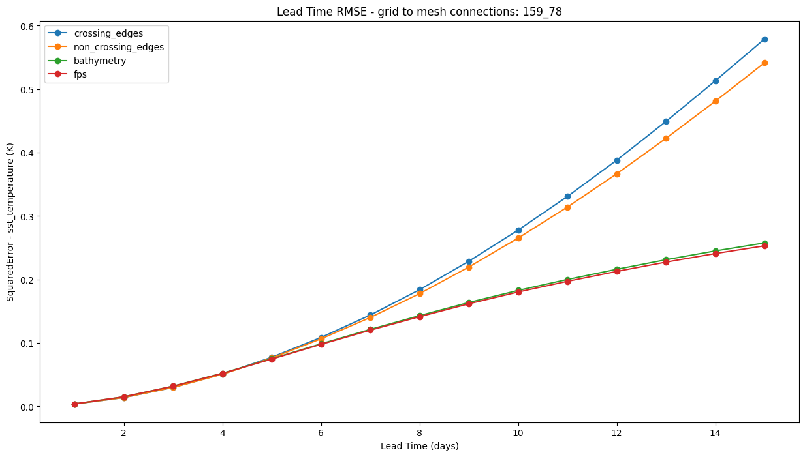

This divergence suggests that, beyond short-term horizons, the geometry and distribution of nodes in the mesh become critical for mitigating error propagation. Adaptive strategies better align with spatial heterogeneity in SST, particularly in regions with strong gradients, which likely reduces the amplification of localized artifacts over time.

Overall, the results show that increasing node count alone is insufficient to improve long-range accuracy. The spatial organization and connectivity of the mesh determine whether additional resolution translates into meaningful gains, with unstructured meshes consistently outperforming regular grids at longer lead times.

When the number of mesh nodes is reduced, the differences between configurations almost disappear across the entire prediction horizon. Unlike in the higher-resolution setting—where unstructured meshes begin to outperform structured ones beyond day five—no clear bifurcation emerges here. All four topologies follow nearly parallel error trajectories, indicating that limited spatial resolution becomes the dominant constraint and suppresses the impact of mesh geometry. Under these conditions, neither bathymetry-based nor FPS meshes can exploit their adaptive placement, and even structured grids do not exhibit distinct degradation patterns. This suggests the existence of a resolution threshold wich is 34, 20: only above a certain node density does mesh topology influence long-range forecast accuracy, whereas below that threshold, representational capacity overrides connectivity design.

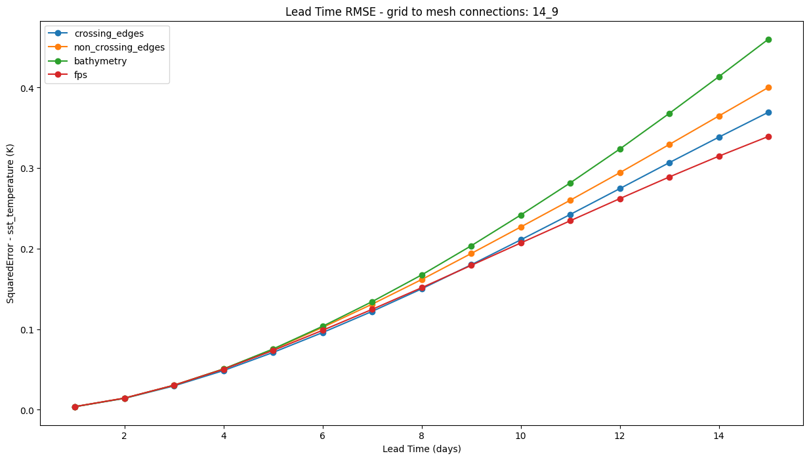 

Notably, the bathymetry-based mesh—which excels when the node count is higher—performs comparatively worse in the low-resolution setting, indicating that adaptive placement requires a minimum node density to be effective. These trends support the existence of both a spatial resolution threshold and a temporal activation window, as the influence of mesh topology only becomes evident beyond approximately five lead-time days and when node density is sufficiently high. Furthermore, the relative performance gap between crossing and non-crossing structures hints at potential amplification of message-passing artifacts in overly rigid or intersecting edge layouts.

## Resultados del análisis por numero de nodos
---
At a one-day lead time, the error curves reveal only minor differences between mesh configurations. Structured meshes (with and without crossing edges) exhibit slightly lower RMSE values compared to the unstructured alternatives, but the overall trajectories remain nearly flat with respect to node count. This suggests that, at such short horizons, forecast accuracy is dominated by the initial conditions and the model’s intrinsic predictive skill, leaving mesh topology with little influence.

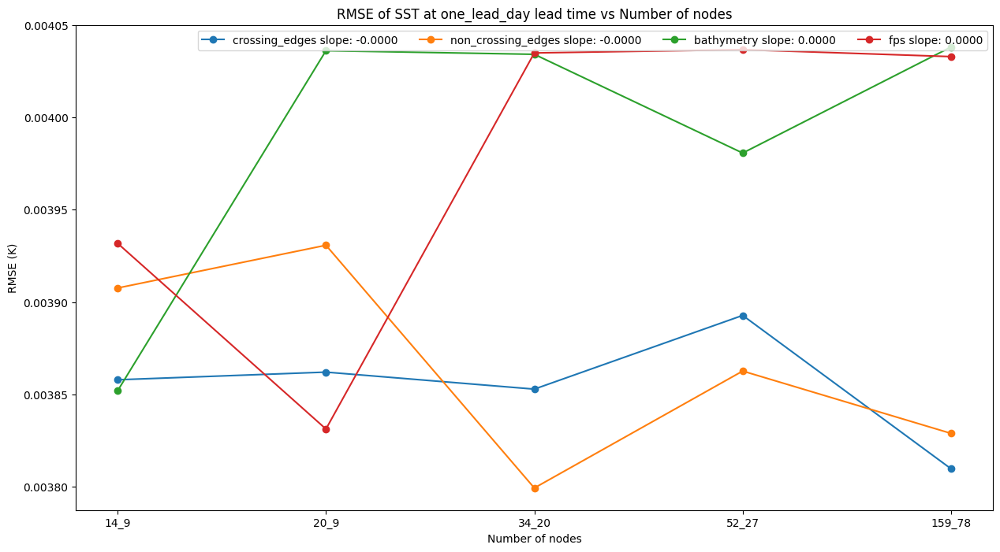

By the five-day lead time, however, a transitional pattern emerges. While structured meshes begin to show a gradual increase in RMSE as the number of nodes grows, the unstructured approaches (FPS and bathymetry-based) remain relatively stable, with bathymetry even displaying a modest downward slope. This indicates that the influence of mesh topology becomes active once the forecast is less constrained by initial observations, allowing unstructured placement to better align with underlying SST gradients.

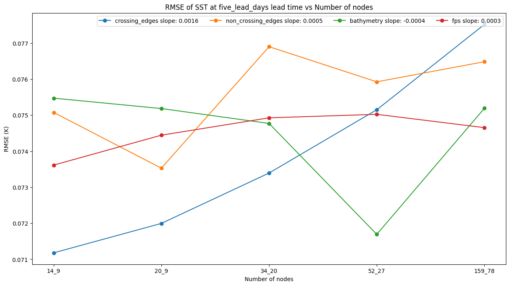

At the fifteen-day horizon, the divergence becomes pronounced. Structured meshes degrade significantly with higher node counts, particularly in the crossing-edge case, where error growth is steepest. In contrast, unstructured meshes benefit from higher resolution: both FPS and bathymetry-based layouts either maintain or reduce their RMSE values as node density increases. This inversion of relative performance highlights that unstructured strategies not only capture spatial heterogeneity more effectively but also scale more robustly as forecast lengthens.

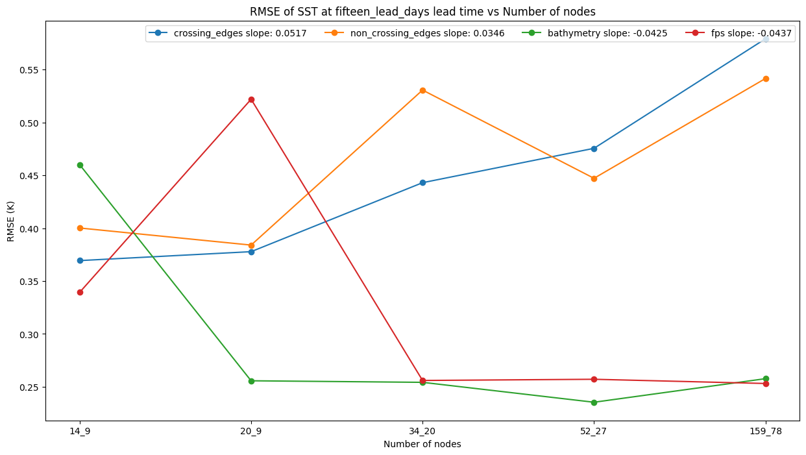

Taken together, the results point to two key mechanisms: a temporal activation window and a spatial resolution threshold. Mesh topology exerts little influence at very short horizons, but beyond approximately five days, unstructured designs begin to suppress error amplification, provided that node density is sufficiently high. Moreover, increasing resolution penalizes structured grids more severely than unstructured ones at longer lead times, confirming that the organization and connectivity of the mesh—not node count alone—determine whether additional resolution translates into improved predictive accuracy.

Here’s a polished version of the interpretation in inglés, redactado como parte de un análisis espacial:


## Spatial Error Patterns Across Mesh Configurations
---

A clear spatial trend emerges when comparing squared-error maps for the lead time 15 across increasing node densities. As the number of nodes grows, the polygonal “tessellation” artifacts become progressively less prominent. This effect is especially visible in the structured meshes, where coarse resolutions produce large, block-like cells that imprint directly onto the RMSE field. With higher node counts, these shapes shrink and their visual impact diminishes, but they do not disappear entirely.

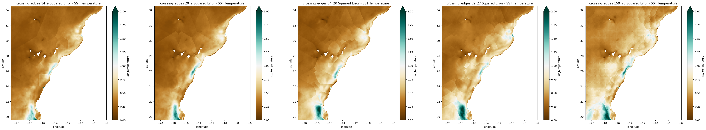
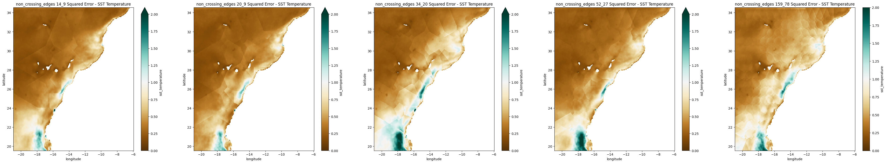

Coastal regions stand out as a persistent hotspot of error in the structured configurations. Even at higher resolutions, these meshes struggle to adequately represent the sharp gradients and complex dynamics typical of nearshore environments. The uniform distribution of nodes and regular connectivity patterns limit their ability to adapt to localized variability, resulting in elevated RMSE values along the coast.

In contrast, the bathymetry-based mesh exhibits fewer visible artifacts and a more coherent spatial structure of error. Because node placement follows the underlying morphology, transitions between coastal and offshore regions are better resolved, which helps reduce artificial discontinuities. Notably, the RMSE near the coast is consistently lower in the bathymetric configuration than in the structured meshes, indicating a closer alignment with the physical variability of SST fields.

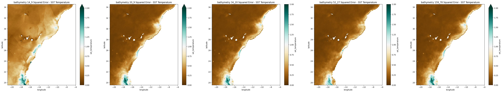

The FPS mesh shows an intermediate behavior. It benefits from increased resolution by reducing artifact size and noise-like patchiness, but it does not suppress coastal errors as effectively as the bathymetry-based layout. While both unstructured approaches avoid the rigid imprinting seen in structured meshes, only the bathymetric design consistently captures the spatial complexity of the coastline.

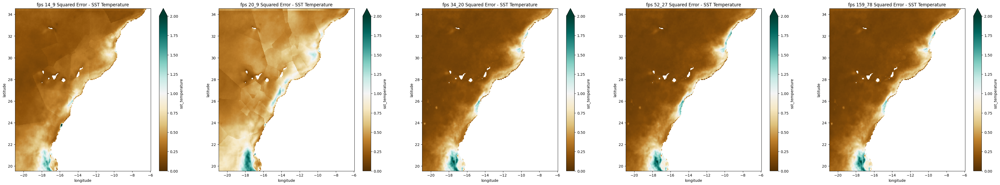

Overall, the maps suggest that increasing resolution alone reduces the visual and statistical footprint of discretization artifacts, but mesh design determines whether these gains translate into improved coastal accuracy. Unstructured configurations—especially the bathymetry-based mesh—provide a more faithful spatial representation, both by minimizing geometric artifacts and by attenuating error growth in regions with strong gradients.

Aquí tienes una redacción integrada, en inglés, que resume lo más relevante de los mapas espaciales para las configuraciones no estructuradas y su contraste implícito con las estructuradas:


### Spatial Error Patterns across configurations along with lead times
---

The unstructured configurations exhibit error patterns that differ substantially from those observed in structured meshes, both in how the RMSE is distributed and how it evolves over time. Even at low node counts, polygonal artifacts are much less pronounced: the error appears spatially coherent rather than imposed by cell geometry, and transitions between regions are smoother.

Coastal areas remain the primary source of error growth across all lead times, but the magnitude and spatial spread differ by mesh type. The bathymetry-based configuration shows the clearest advantage: it not only reduces coastal RMSE relative to structured meshes but also constrains the offshore expansion of error at longer lead times. This suggests that aligning node placement with seabed morphology improves the representation of nearshore gradients and limits physically unrealistic propagation.

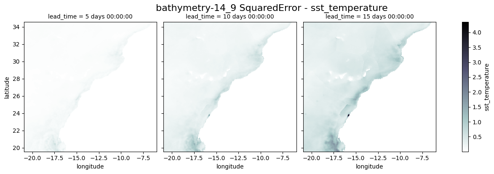

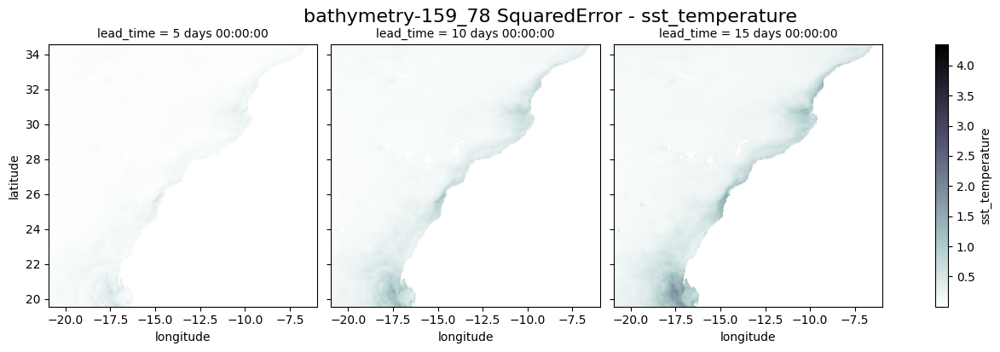

The FPS mesh also benefits from unstructured connectivity, displaying fewer discretization artifacts and a smoother progression of RMSE with lead time. However, its ability to constrain error along the coast is weaker than that of the bathymetric layout, particularly by day 15, when larger patches of elevated RMSE begin to diffuse seaward.

Resolution plays a different role in unstructured designs compared to structured grids. In structured meshes, increasing node count primarily shrinks the size of geometric artifacts without altering their spatial footprint. In contrast, higher node density in the unstructured meshes—especially the bathymetry-based one—translates into genuinely improved spatial distribution of error. At 159_78 nodes, the bathymetric mesh shows a more realistic containment of error in dynamically active zones, rather than the broad inland or offshore spread visible in structured counterparts.

Overall, the spatial fields indicate that unstructured meshes not only produce fewer artificial patterns but also modulate how and where the error grows over time. The bathymetry-based configuration stands out as the most robust in this regard, while FPS offers intermediate improvements over structured baselines. These spatial behaviors are consistent with the quantitative trends observed in the RMSE curves across lead times and node counts.
